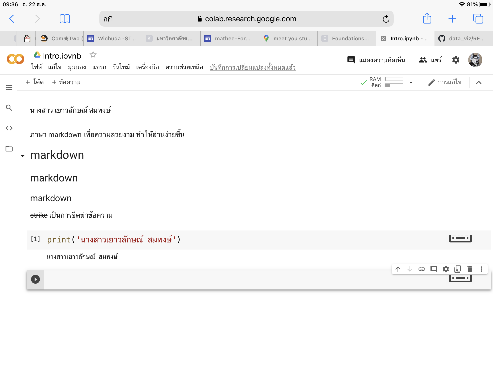
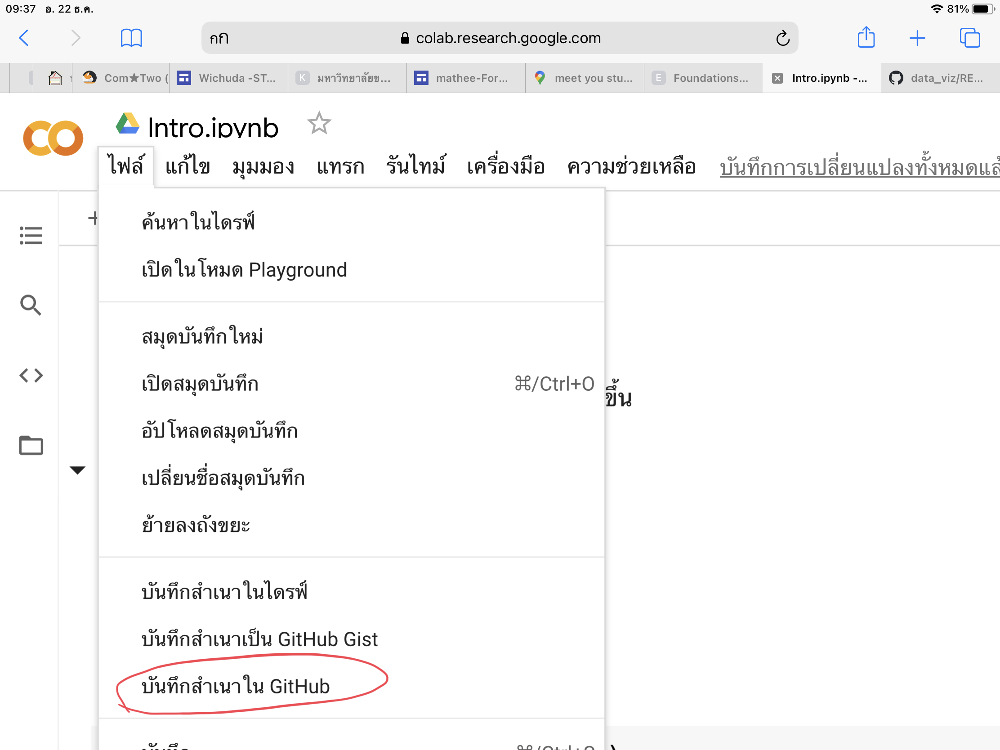
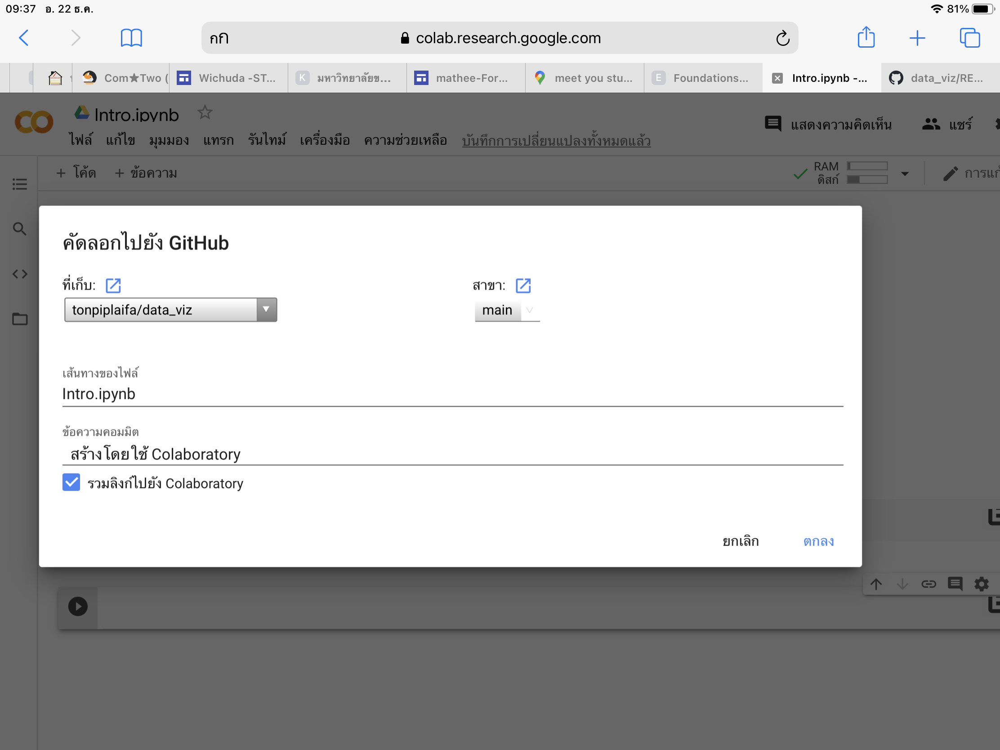
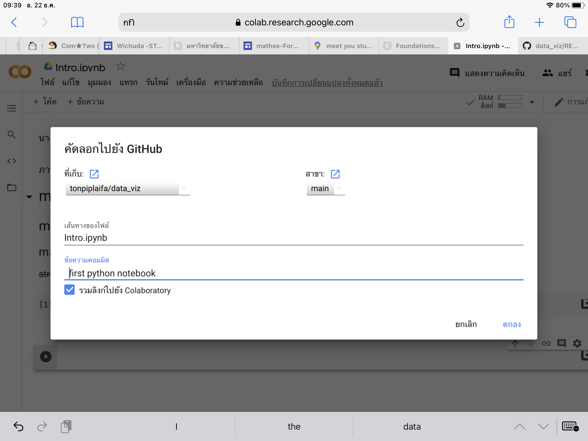
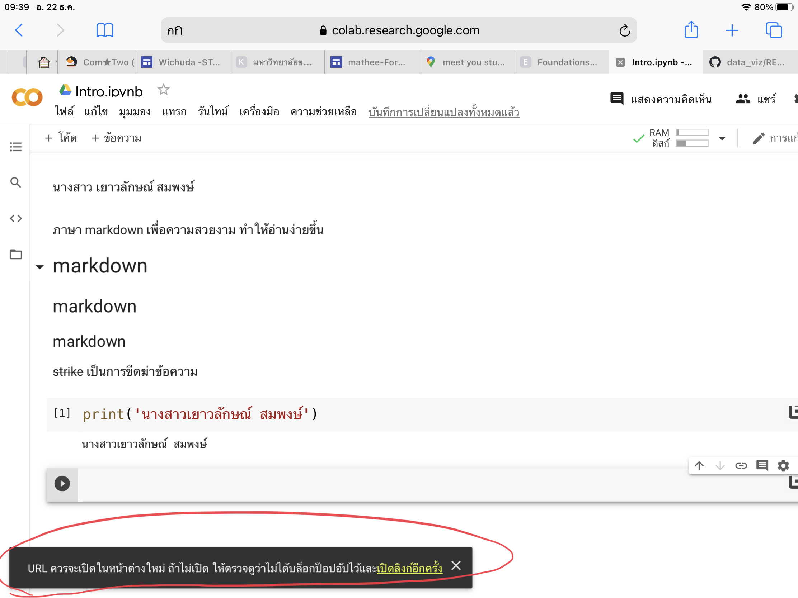
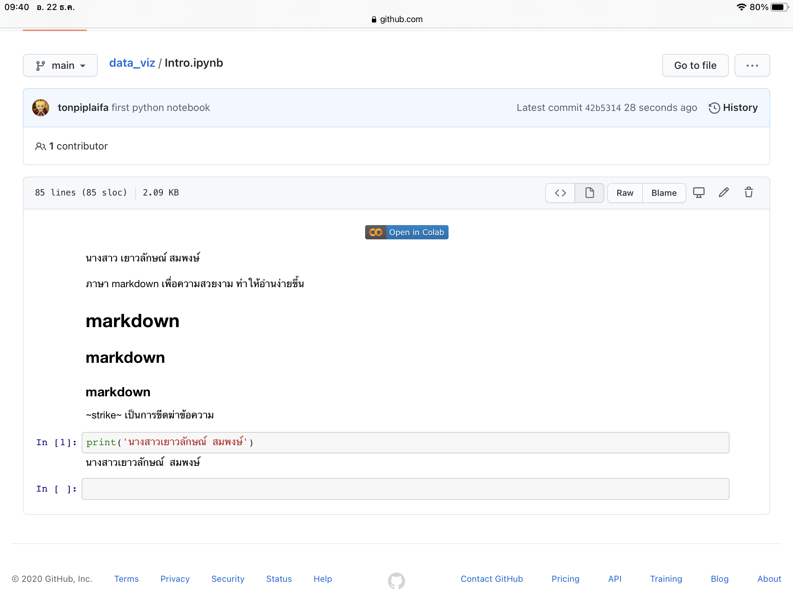
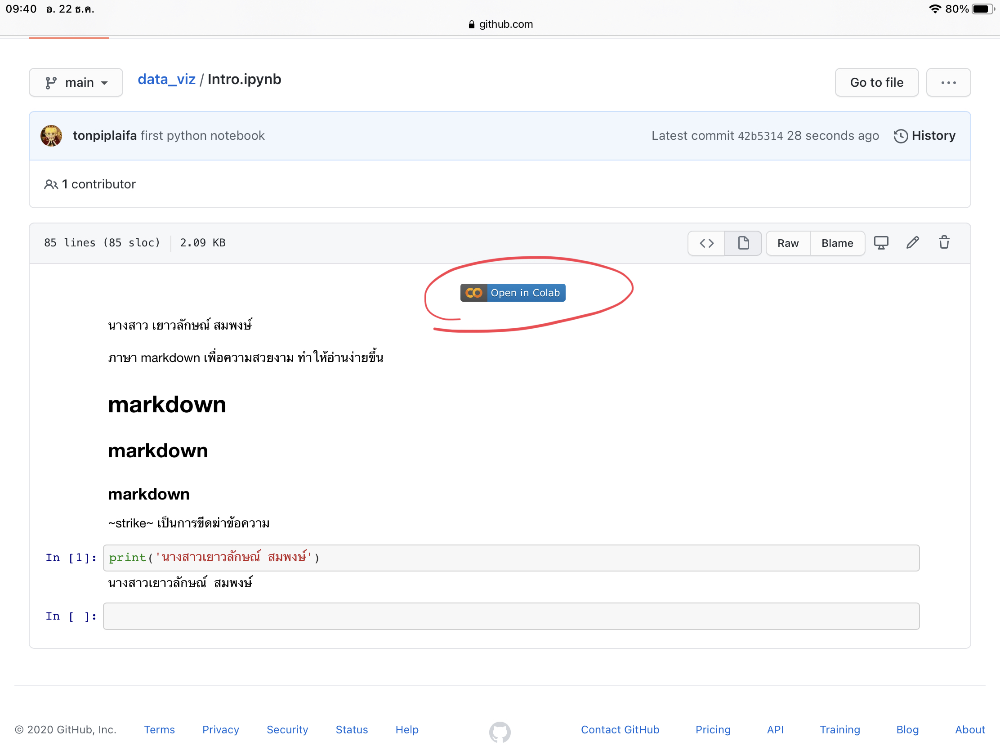

# data_viz

นางสาวเยาวลักษณ์ สมพงษ์ 613020243-9

## ขั้นตอนการบันทึก google colab ลงใน github

**1. เปิดไปที่ google colab ในไฟล์โปรเจคที่ต้องการจะบันทึกลงใน github**

**2. กดที่ ไฟล์ -> บันทึกสำเนาใน github**

**3. จากนั้นจะมีหน้าต่างขึ้นมาให้ สามารถเลือกที่เก็บที่เราต้องการ เปลี่ยนชื่อไฟล์ และ commit ไปว่าเราทำตรงไหนแล้วบ้างเพื่อที่จะได้รู้ว่าทำถึงไหนแล้ว จากนั้นกดตกลง**

**สามารถเลือกที่เก็บที่เราต้องการ เปลี่ยนชื่อไฟล์ และ commit ไปว่าเราทำตรงไหนแล้วบ้างเพื่อที่จะได้รู้ว่าทำถึงไหนแล้ว จากนั้นกดตกลง**

**4. เมื่อทำการบันทึกเรียบร้อยแล้วจะขึ้นตามภาพที่วงสีแดงไว้ เราสามารถกดไปดูโปรเจคที่ถูกบันทึกไว้ใน github ได้**

**5. จะขึ้นตามภาพ**

**6. สามารถกดที่ google colab เพื่อกลับไปแก้ไขหรือทำต่อจากที่บันทึกไว้ได้**

                  
                  
                  
 **✨จ.บ.✨**

